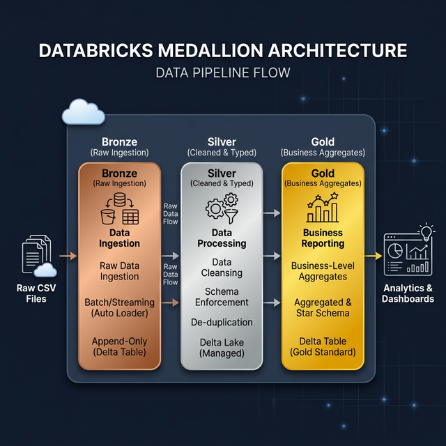

<p align="center">
  
</p>

<h1 align="center">🏗️ Databricks Medallion Architecture — E-Commerce Data Pipeline</h1>

<p align="center">
  <em>A production-style, three-layer data lakehouse pipeline built on Databricks &amp; Delta Lake</em>
</p>

<p align="center">
  
  
  
  
</p>

---

## 📖 Overview

This project implements the **Medallion Architecture** (Bronze → Silver → Gold) on **Databricks** using **Delta Lake** and **Unity Catalog**. It processes the [Olist Brazilian E-Commerce](https://www.kaggle.com/datasets/olistbr/brazilian-ecommerce) dataset through three progressively refined layers:

| Layer | Purpose | Schema |
|:-----:|---------|--------|
| 🥉 **Bronze** | Raw ingestion — faithful copy of source CSVs with ingestion metadata | `medallion_trial.bronze` |
| 🥈 **Silver** | Cleaned & typed — proper data types, deduplication, null handling | `medallion_trial.silver` |
| 🥇 **Gold** | Business aggregates — analytics-ready tables (e.g., daily revenue) | `medallion_trial.gold` |

---

## 🗂️ Project Structure

```
databricks_medallion_arch/
│
├── 📁 schema_mgt/                          # Infrastructure setup
│   └── catalog_and_schema_creation.ipynb   # Creates catalog, schemas & volumes
│
├── 📁 src/                                 # ETL pipeline notebooks
│   ├── 01_ingest_to_bronze.ipynb           # CSV → Bronze Delta tables
│   ├── 02_transform_to_silver.ipynb        # Bronze → Silver (clean & type)
│   └── 03_aggregate_to_gold.ipynb          # Silver → Gold (daily revenue)
│
├── 📁 docs/                                # Documentation assets
│   └── architecture_diagram.png            # Architecture overview diagram
│
├── .gitignore
└── README.md
```

---

## 🚀 Getting Started

### Prerequisites

- A **Databricks workspace** with Unity Catalog enabled
- Databricks Runtime **13.3 LTS** or later (tested on 15.x)
- Access to create catalogs, schemas, and volumes

### Step-by-Step Setup

#### 1️⃣ Clone this Repository

```bash
git clone https://github.com/<your-username>/databricks_medallion_arch.git
```

#### 2️⃣ Import Notebooks into Databricks

Import the entire repository into your Databricks workspace via **Repos** or upload the `.ipynb` files manually.

#### 3️⃣ Upload the Source Data

Download the [Olist dataset from Kaggle](https://www.kaggle.com/datasets/olistbr/brazilian-ecommerce) and upload these CSV files to the Unity Catalog Volume:

```
/Volumes/medallion_trial/bronze/raw_landing_zone/
├── olist_orders_dataset.csv
├── olist_order_items_dataset.csv
├── olist_customers_dataset.csv
└── olist_products_dataset.csv
```

#### 4️⃣ Run the Notebooks in Order

| Step | Notebook | Description |
|:----:|----------|-------------|
| 0 | `schema_mgt/catalog_and_schema_creation` | Create catalog, schemas, and volume |
| 1 | `src/01_ingest_to_bronze` | Ingest raw CSVs into Bronze Delta tables |
| 2 | `src/02_transform_to_silver` | Clean, type-cast, and deduplicate into Silver |
| 3 | `src/03_aggregate_to_gold` | Join and aggregate into Gold analytics tables |

---

## 📓 Notebook Details

### `schema_mgt/catalog_and_schema_creation` — Infrastructure Setup

Creates the foundational Unity Catalog resources:
- **Catalog:** `medallion_trial`
- **Schemas:** `bronze`, `silver`, `gold`
- **Volume:** `bronze.raw_landing_zone` for raw file storage

### `src/01_ingest_to_bronze` — Raw Ingestion

- Reads CSV files with `inferSchema=false` (all strings) to preserve raw fidelity
- Adds `ingest_timestamp` metadata column for lineage tracking
- Writes as **overwrite** Delta tables (full-refresh pattern)
- Includes a validation query to preview ingested data

### `src/02_transform_to_silver` — Data Cleaning

**Orders table:**
- Casts `order_purchase_timestamp` and `order_delivered_customer_date` to `TimestampType`
- Deduplicates on `order_id`
- Drops rows missing `order_id` or `customer_id`

**Order Items table:**
- Casts `price` and `freight_value` to `FloatType`
- Deduplicates on composite key (`order_id`, `order_item_id`)

### `src/03_aggregate_to_gold` — Business Aggregates

- Inner-joins orders with order items on `order_id`
- Extracts `order_date` from purchase timestamp
- Computes **daily revenue** (`total_revenue_usd`) and **daily freight** (`total_freight_usd`)
- Includes validation queries and a revenue trend visualization

---

## 🏛️ Architecture Deep Dive

### Why Medallion Architecture?

The Medallion Architecture provides a **structured approach** to organizing data in a lakehouse:

```
┌──────────────┐     ┌──────────────────┐     ┌─────────────────────┐
│              │     │                  │     │                     │
│   BRONZE     │────▶│     SILVER       │────▶│       GOLD          │
│              │     │                  │     │                     │
│  Raw data    │     │  Cleaned data    │     │  Business-ready     │
│  as-is from  │     │  with proper     │     │  aggregates &       │
│  source      │     │  types & quality │     │  KPIs               │
│              │     │  gates           │     │                     │
└──────────────┘     └──────────────────┘     └─────────────────────┘
```

| Principle | Implementation |
|-----------|---------------|
| **Raw fidelity** | Bronze stores all data as strings — no data loss |
| **Data quality** | Silver applies type casting, dedup, and null checks |
| **Business logic** | Gold contains only analytics-ready aggregates |
| **Lineage** | `ingest_timestamp` tracks when data entered the pipeline |
| **Idempotency** | All writes use `overwrite` mode for safe re-runs |

### Technology Stack

| Component | Technology |
|-----------|-----------|
| Compute | Databricks (Apache Spark) |
| Storage Format | Delta Lake (ACID transactions, time travel) |
| Governance | Unity Catalog (access control, lineage, discovery) |
| Language | PySpark + SQL |
| Source Data | Olist Brazilian E-Commerce (Kaggle) |

---

## 📊 Sample Output

After running all notebooks, query the Gold table:

```sql
SELECT *
FROM   medallion_trial.gold.daily_revenue
WHERE  order_date IS NOT NULL
ORDER  BY total_revenue_usd DESC
LIMIT  5;
```

| order_date | total_revenue_usd | total_freight_usd |
|:----------:|:-----------------:|:-----------------:|
| 2017-11-24 | 115,353.81 | 18,241.65 |
| 2018-01-05 | 52,187.42 | 8,934.21 |
| 2017-11-23 | 49,823.19 | 7,561.33 |
| ... | ... | ... |

---

## 🧩 Extending the Pipeline

Here are some ideas for extending this project:

- **Add more Gold tables** — customer lifetime value, product category performance, delivery SLA analysis
- **Incremental loads** — switch Bronze from `overwrite` to `append` mode with Auto Loader
- **Data quality framework** — integrate [Great Expectations](https://greatexpectations.io/) or Databricks built-in expectations
- **Orchestration** — use Databricks Workflows or Apache Airflow to schedule the pipeline
- **CI/CD** — add Databricks Asset Bundles (DABs) for automated deployment
- **Streaming** — convert to Structured Streaming for near-real-time processing

---

## 📜 License

This project is open source and available under the [MIT License](LICENSE).

---

## 🙏 Acknowledgments

- **Dataset:** [Olist Brazilian E-Commerce Dataset](https://www.kaggle.com/datasets/olistbr/brazilian-ecommerce) on Kaggle
- **Platform:** [Databricks](https://www.databricks.com/) Community Edition
- **Architecture Pattern:** [Medallion Architecture](https://www.databricks.com/glossary/medallion-architecture) by Databricks

---

<p align="center">
  Made with ❤️ on Databricks
</p>
